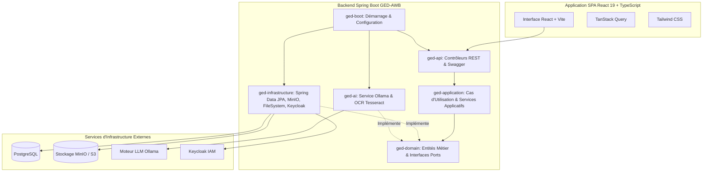

# 📁 GED-AWB — Système Intelligent de Gestion Électronique des Documents

[](https://www.oracle.com/java/)
[](https://spring.io/projects/spring-boot)
[](https://react.dev/)
[](https://www.typescriptlang.org/)
[](https://vitejs.dev/)
[](#)

**GED-AWB** (*Gestion Électronique des Documents - Attijariwafa Bank*) est un système de gestion électronique de documents (GED / EDMS) d'entreprise, puissant et propulsé par l'IA. Conçu sur une **Architecture Hexagonale (Ports et Adaptateurs)** et une interface moderne et réactive, GED-AWB offre un stockage sécurisé de documents, le contrôle de version, la reconnaissance optique de caractères (OCR), l'assistance IA locale via un LLM, la gestion dynamique des droits et un audit de conformité complet.

---

## 🌟 Fonctionnalités Clés

### 📑 Gestion des Documents et Contenus
* **Explorateur Hiérarchique** : Arborescence de dossiers, téléversement par glisser-déposer, navigation par fil d'Ariane (*breadcrumbs*) et actions groupées.
* **Cycle de Vie du Document** : Gestion des versions, verrouillage (*check-out* / *check-in*), corbeille avec récupération (*soft-delete*) et archivage permanent.
* **Métadonnées Dynamiques & Étiquetage** : Catégories personnalisées, schémas de métadonnées clé-valeur, association de tags et affectation par département.
* **Stockage Multi-Format** : Moteur de stockage flexible prenant en charge le système de fichiers local (**FileSystem**) et le stockage objet **S3 / MinIO**.

### 🤖 Intelligence Documentaire & OCR
* **Intégration LLM Local** : Propulsé par **Spring AI** & **Ollama** (ex: `llama3.2:3b`) pour la synthèse et les questions-réponses interactives sur les documents en toute confidentialité.
* **Extraction OCR** : Extraction automatique du texte depuis les images et PDF scannés via **Tesseract OCR**.
* **Analyse Documentaire Intelligente** : Suggestions de classification automatique basées sur le contenu du document.

### 🔒 Sécurité d'Entreprise & Gouvernance
* **Intégration Keycloak** : Authentification OAuth2 / OpenID Connect (OIDC) avec vérification de jetons JWT.
* **Gestion Fine des Permissions** : Listes de contrôle d'accès (ACL) granulaires par dossier et document (`READ`, `WRITE`, `DELETE`, `MANAGE`).
* **Audit & Conformité** : Journalisation d'audit événementielle enregistrant toutes les modifications, changements de droits et actions des utilisateurs.

---

## 🏗️ Architecture & Structure du Projet

Le backend respecte l'**Architecture Hexagonale (Clean Architecture / Ports & Adaptateurs)** pour garantir une séparation stricte entre la logique métier, les cas d'utilisation applicatifs et les frameworks d'infrastructure.



### Description des Modules

| Module | Description |
| :--- | :--- |
| [`ged-domain`](file:///c:/Users/HP/Documents/GED-ATTIJARI/ATTIJARI/ged-domain) | **Cœur Métier (Domain)**. Contient les entités métier purement Java (`Document`, `Folder`, `User`, `Role`, `TrashItem`, `AuditLog`), les services du domaine et les interfaces de ports de dépôt. Aucune dépendance de framework externe. |
| [`ged-application`](file:///c:/Users/HP/Documents/GED-ATTIJARI/ATTIJARI/ged-application) | **Couche Applicative (Use Cases)**. Orchestre les objets métier pour exécuter les flux opérationnels. Inclut les DTOs, les mappers (MapStruct) et les ports d'entrée/sortie. |
| [`ged-infrastructure`](file:///c:/Users/HP/Documents/GED-ATTIJARI/ATTIJARI/ged-infrastructure) | **Couche Adaptateurs**. Implémentations Spring Data JPA, persistance PostgreSQL, migrations Flyway, adaptateurs de stockage FileSystem/MinIO et convertisseurs Keycloak JWT. |
| [`ged-ai`](file:///c:/Users/HP/Documents/GED-ATTIJARI/ATTIJARI/ged-ai) | **Services IA & Intelligence**. Gère l'intégration du LLM local via Spring AI & Ollama, ainsi que la reconnaissance de texte OCR avec Tesseract. |
| [`ged-api`](file:///c:/Users/HP/Documents/GED-ATTIJARI/ATTIJARI/ged-api) | **Couche Présentation**. Contrôleurs RESTful, schémas OpenAPI/Swagger (`springdoc-openapi`), mappings de requêtes/réponses et gestionnaires d'exceptions. |
| [`ged-boot`](file:///c:/Users/HP/Documents/GED-ATTIJARI/ATTIJARI/ged-boot) | **Point d'Entrée de l'Application**. Contient le bootstrap `GedApplication.java`, les fichiers de configuration `application.yml` et les auto-configurations Spring Boot. |
| [`ged-common`](file:///c:/Users/HP/Documents/GED-ATTIJARI/ATTIJARI/ged-common) | **Utilitaires Communs**. Utilitaires transversaux, hiérarchie d'exceptions, constantes partagées et abstractions d'événements du domaine. |
| [`frontend`](file:///c:/Users/HP/Documents/GED-ATTIJARI/ATTIJARI/frontend) | **Application Web SPA**. Développée avec React 19, TypeScript, Vite, Tailwind CSS, TanStack Query, React Hook Form et Lucide React. |

---

## 🛠️ Technologies Utilisées

### Backend
* **Java** : 21
* **Framework** : Spring Boot 3.4+ / 4.1
* **Sécurité** : Spring Security 6 / Serveur de Ressources OAuth2 avec Keycloak JWT
* **Persistance** : Spring Data JPA, Hibernate, PostgreSQL
* **Migrations** : Flyway
* **Stockage Objet** : FileSystem / SDK MinIO
* **IA & OCR** : Spring AI (Ollama - `llama3.2:3b`), Tesseract OCR
* **Boilerplate & Mapping** : Lombok, MapStruct
* **Documentation API** : SpringDoc OpenAPI 3 (Interface Swagger UI)

### Frontend
* **Cœur** : React 19, TypeScript 5, Vite 8
* **Styles** : Tailwind CSS, PostCSS
* **Gestion d'État & Requêtes** : TanStack React Query v5, Axios
* **Formulaires & Validation** : React Hook Form, validation Zod
* **Icônes & UI** : Lucide React
* **Qualité du Code** : Oxlint

---

## 🚀 Démarrage Rapide

### Prérequis

Assurez-vous d'avoir installé les éléments suivants sur votre machine :
* **Java Development Kit (JDK)** : Version 21 ou supérieure
* **Apache Maven** : Version 3.8+
* **Node.js** : Version 18+ & **npm**
* **Docker & Docker Compose** : (Recommandé pour PostgreSQL, MinIO, Keycloak et Ollama)
* **Tesseract OCR** : Optionnel (Requis si le traitement OCR local est activé)

---

### 1. Configuration de la Base de Données & des Services

Démarrez PostgreSQL et les services associés en local ou via Docker :

```bash
# Exemple de lancement de PostgreSQL avec Docker
docker run -d \
  --name ged-postgres \
  -e POSTGRES_DB=ged_db \
  -e POSTGRES_USER=ged_app_user \
  -e POSTGRES_PASSWORD=votre_mot_de_passe_securise \
  -p 5432:5432 \
  postgres:16
```

---

### 2. Démarrage du Backend (`ged-boot`)

1. Naviguez vers le dossier racine du projet.
2. Compilez le projet multi-module Maven :
   ```bash
   mvn clean install
   ```
3. Définissez les variables d'environnement (ou modifiez le fichier [`ged-boot/src/main/resources/application.yml`](file:///c:/Users/HP/Documents/GED-ATTIJARI/ATTIJARI/ged-boot/src/main/resources/application.yml)) :
   ```env
   DB_PASSWORD=votre_mot_de_passe_securise
   GED_STORAGE_TYPE=filesystem # Options: filesystem | minio
   ```
4. Lancez l'application Spring Boot :
   ```bash
   mvn spring-boot:run -pl ged-boot
   ```
   * Le serveur API sera accessible sur : `http://localhost:8080`
   * Documentation Swagger UI : `http://localhost:8080/swagger-ui.html`

---

### 3. Démarrage du Frontend (`frontend`)

1. Accédez au répertoire du frontend :
   ```bash
   cd frontend
   ```
2. Installez les dépendances npm :
   ```bash
   npm install
   ```
3. Lancez le serveur de développement :
   ```bash
   npm run dev
   ```
   * Ouvrez votre navigateur sur `http://localhost:5173`

---

## ⚙️ Aperçu de la Configuration

Les configurations principales du backend se trouvent dans [`ged-boot/src/main/resources/application.yml`](file:///c:/Users/HP/Documents/GED-ATTIJARI/ATTIJARI/ged-boot/src/main/resources/application.yml) :

```yaml
spring:
  datasource:
    url: jdbc:postgresql://localhost:5433/ged_db
    username: ged_app_user
    password: ${DB_PASSWORD}
  ai:
    ollama:
      base-url: http://localhost:11434
      chat:
        model: llama3.2:3b

tesseract:
  datapath: C:\Program Files\Tesseract-OCR\tessdata

ged:
  storage:
    type: ${GED_STORAGE_TYPE:filesystem}
    base-path: ./storage-data
    minio:
      endpoint: http://localhost:9000
      access-key: minioadmin
      secret-key: minioadmin123
      bucket: ged-documents
```

---

## 📌 Résumé des Principaux Points d'Accès (API)

| Méthode | Endpoints | Description |
| :--- | :--- | :--- |
| `POST` | `/api/v1/documents/upload` | Téléverser un nouveau document avec catégorie, métadonnées et tags |
| `GET` | `/api/v1/documents/{id}` | Récupérer les détails et métadonnées d'un document |
| `GET` | `/api/v1/documents/{id}/download` | Télécharger le fichier d'un document |
| `POST` | `/api/v1/documents/{id}/checkout` | Verrouiller un document pour édition (Check-out) |
| `POST` | `/api/v1/documents/{id}/checkin` | Publier une nouvelle version et déverrouiller le document (Check-in) |
| `DELETE`| `/api/v1/documents/{id}` | Supprimer temporairement un document (déplacement vers la corbeille) |
| `POST` | `/api/v1/ai/chat` | Assistant conversationnel IA sur le contenu des documents |
| `POST` | `/api/v1/ai/analyze/{id}` | Exécuter l'analyse IA et l'extraction de texte OCR |
| `GET` | `/api/v1/folders` | Lister la hiérarchie des dossiers (racine ou imbriqués) |
| `GET` | `/api/v1/trash` | Consulter les éléments présents dans la corbeille |

---

## 📝 Tests & Vérification

Exécuter les tests unitaires et d'intégration du backend :
```bash
mvn test
```

Exécuter la vérification du code et la compilation du frontend :
```bash
cd frontend
npm run lint
npm run build
```

---

## 🔒 Sécurité & Contrôle d'Accès

GED-AWB s'appuie sur Keycloak pour la gestion des identités et des accès. Les jetons d'accès des utilisateurs doivent contenir les rôles appropriés (`ROLE_USER`, `ROLE_ADMIN`) ainsi que les attributs de département pour accéder aux ressources REST protégées.

---

## 📄 Licence

Application Entreprise Interne — **Attijariwafa Bank (AWB)**. Tous droits réservés. Propriétaire & Confidentiel.
